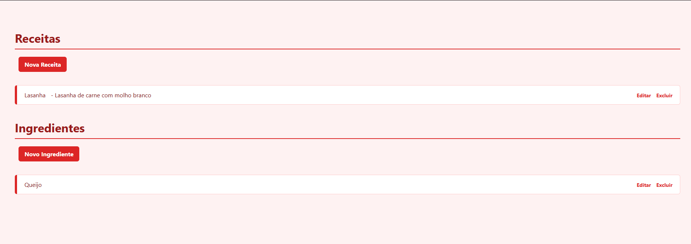

# 🍝 Sistema de Receitas com Ingredientes

Bem-vindo ao nosso projeto de **Sistema de Receitas**, uma aplicação web desenvolvida com **Java**, **Spring Boot** e **Thymeleaf**, onde é possível cadastrar receitas e associar os ingredientes utilizados. O objetivo é proporcionar uma interface simples e funcional para gestão culinária.

---

## 🚀 Tecnologias Utilizadas

- 
- 
- 
- 
- 

---

## 🧩 Funcionalidades

- ✅ Cadastro de Ingredientes com nome, quantidade e medida
- ✅ Cadastro de Receitas com descrição, tempo de preparo e múltiplos ingredientes
- ✅ Edição e exclusão de ingredientes e receitas
- ✅ Relacionamento entre receitas e ingredientes (N:N)
- ✅ Interface web interativa com **Thymeleaf**

---


## 📷 Imagem da Interface



---

## 🛠 Como Rodar o Projeto

### Pré-requisitos:

- Java 21
- Maven 3.8+
- IDE (como IntelliJ, Eclipse ou VSCode)
- MySQL ou banco H2 configurado no `application.properties`

### Passos:

1. Clone o repositório:
```bash
git clone https://github.com/seu-usuario/seu-repositorio.git
cd nome-do-projeto
./mvnw spring-boot:run
http://localhost:8080
```
---

## 👨‍💻 Desenvolvedores

| Nome                         | RM        |
|------------------------------|-----------|
| André de Sousa Neves         | RM-553515 |
| Thaís Gonçalves Leoncio      | RM-553892 |
| Eduardo Brites Coutinho      | RM-552943 |
| Beatriz Dantas Sampaio       | RM-554044 |
| Isabela Barcellos Freire     | RM-553746 |
| Karolina Araujo Soares       | RM-554187 |
